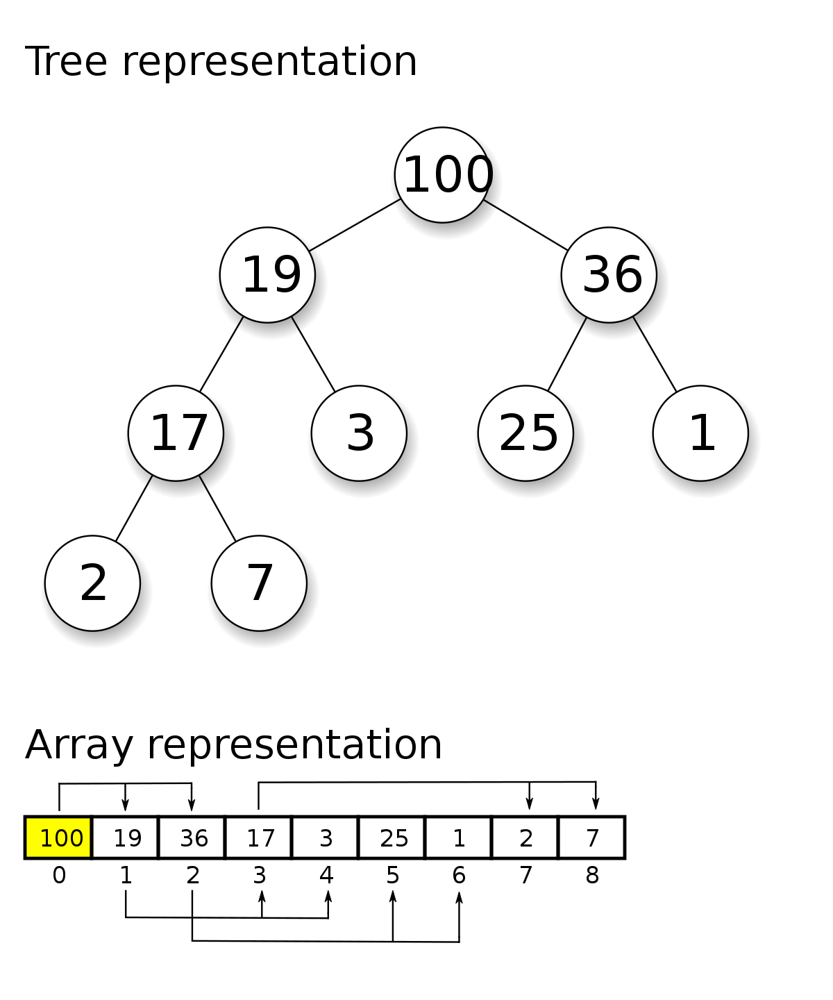
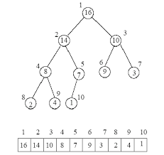

# Priority Queue

Imagine a lunch line, but instead of ordering people by the time they
arrived at the line, stronger people can push and arrive first in the
line. As a result, this 'queue' is now a 'Priority Queue', and it is
sorted by priority.

### Definition

A priority queue is a collection that associates each added element
with a priority or importance and allows access or removal of the
elements in order or priority.

### Java `PriorityQueue`

Java's Collections Framework in `java.util` includes a class called
`PriorityQueue` that arranges elements into their natural ordering
from smallest to largest.

```java
import java.util.PriorityQueue;

public class Main {
    public static void main(String[] args) {
        Queue<Integer> pq = new PriorityQueue<>();
        // new PriorityQueue<>(comparator) to have custom comparison
        pq.add(42);
        pq.add(17);
        pq.add(9);
        pq.add(42);
        pq.add(35);
        pq.add(-1);
        pq.add(88);
        // will print -1 9 17 35 42 42 88
        while (!pq.isEmpty()) {
            System.out.print(pq.remove() + " ");
        }
    }
}
```

This will create a max priority queue

```java
import java.util.Collections;
import java.util.PriorityQueue;

public class Main {
    public static void main(String[] args) {
        Queue<Integer> pq = new PriorityQueue<>(Collections.reverseOrder());
        pq.add(42);
        pq.add(17);
        pq.add(9);
        pq.add(42);
        pq.add(35);
        pq.add(-1);
        pq.add(88);
        // will print 88 42 42 35 17 9 -1
        while (!pq.isEmpty()) {
            System.out.print(pq.remove() + " ");
        }
    }
}
```

### Heaps

A heap is a tree that arranges its elements with a vertical ordering.
In a minimum heap, or *min-heap*, child nodes always store values
greater than or equal to the parent's value. In a maximum heap, or
*max-heap*, a parent node's value is always greater than or equal to
those of its children.



### Array representation of heaps

Heaps are usually represented using arrays because it is compact
and fast. The root node is at index 0. To find the parent of the
node, go to (index - 1) / 2. The left child of a node is at
(index * 2) + 1, the right child is at (index * 2) + 2



### Advantages

- Very fast
- Simple interface
- Efficient in storage

### Disadvantages

- Can only get min or max
- Slower than Queue