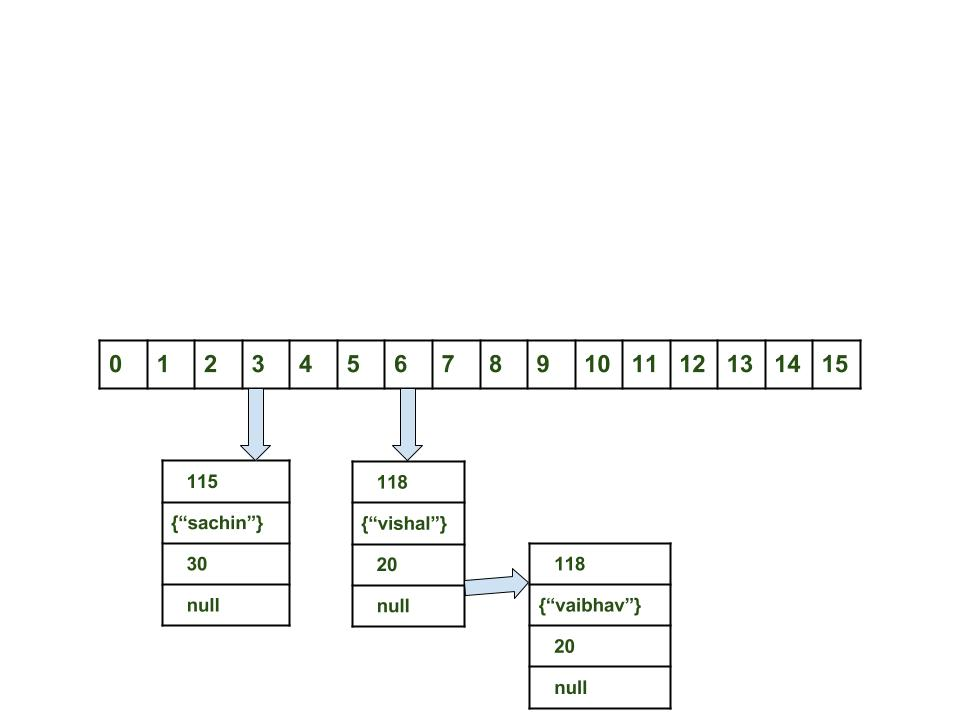

# Maps

You want to know the phone number of a bunch of people. However, you hate
flipping through every page to find the number matching a specific name.
You can use Maps to solve this problem!

### Definition

A collection that associates objects called keys with objects called
values.

### Key and Value

The key is used to look up a value, and keys must be unique.

The value is the result of a lookup.

In a dictionary, the key is the word, while the value is the definition.

### Maps in Java

In the java collections framework, there are two primary classes that
implement the `Map` interface: `HashMap`s and `TreeMap`s.

### HashMaps

Like `HashSet`s, `HashMap`s use a *Hash Table* to store key value pairs.
This allows pretty much constant lookup and insertion.



#### Example of `HashMap`

```java
public class Main {
    public static void main(String[] args) {
        Map<String, Integer> phoneBook = new HashMap<>();
        // HashMap<String, Integer> phoneBook = new HashMap<>();
        
        // insertion
        phoneBook.put("Bob", 1234567890);
        phoneBook.put("Joe", 0987654321);
        
        // lookup
        int bobsNumber = phoneBook.get("Bob");
        
        // remove Bob
        phoneBook.remove("Bob"); // bob is no longer in phonebook
        
        for (Map.Entry<String, Integer> entry : phoneBook.entrySet()) {
            // printing out the key
            System.out.println(entry.getKey());
            // printing out the value
            System.out.println(entry.getValue());
        }
        // the shorter way
        phoneBook.forEach((k, v) -> {
            // printing out the key
            System.out.println(k);
            // printing out the value
            System.out.println(v);
        });
    }
}
```

#### Benefits

- Constant time insertion
- Constant time lookup
- Constant time removal

#### Drawbacks

- If you have a bad hash, it is slow
- You need to think of a good hash function for your object
- Unordered

### `TreeMap`s

TreeMaps use a binary search tree to implement the Map interface. It
has logarithmic complexity for most operations

#### Example

```java
public class Main {
    public static void main(String[] args) {
        Map<String, Integer> phoneBook = new TreeMap<>();
        // TreeMap<String, Integer> phoneBook = new TreeMap<>();

        // insertion
        phoneBook.put("Bob", 1234567890);
        phoneBook.put("Joe", 0987654321);

        // lookup
        int bobsNumber = phoneBook.get("Bob");

        // remove Bob
        phoneBook.remove("Bob"); // bob is no longer in phonebook

        // looping through the map sorted by key
        for (Map.Entry<String, Integer> entry : phoneBook.entrySet()) {
            // printing out the key
            System.out.println(entry.getKey());
            // printing out the value
            System.out.println(entry.getValue());
        }
        // the shorter way
        phoneBook.forEach((k, v) -> {
            // printing out the key
            System.out.println(k);
            // printing out the value
            System.out.println(v);
        });
    }
}
```

#### Image


#### Benefits

- Logarithmic time insertion, deletion, lookup
- Ordered from least to greatest by key
- Guaranteed time complexity

#### Drawbacks

- Slower than `HashMap`