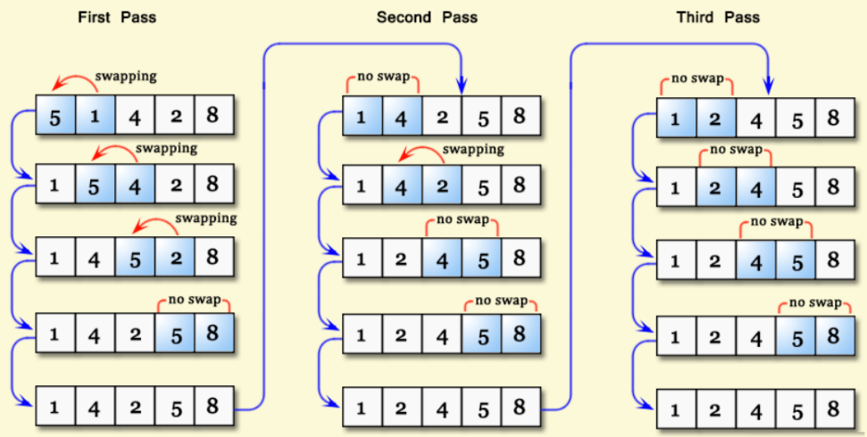
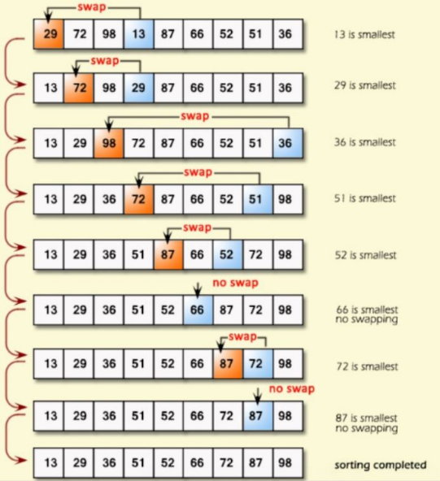
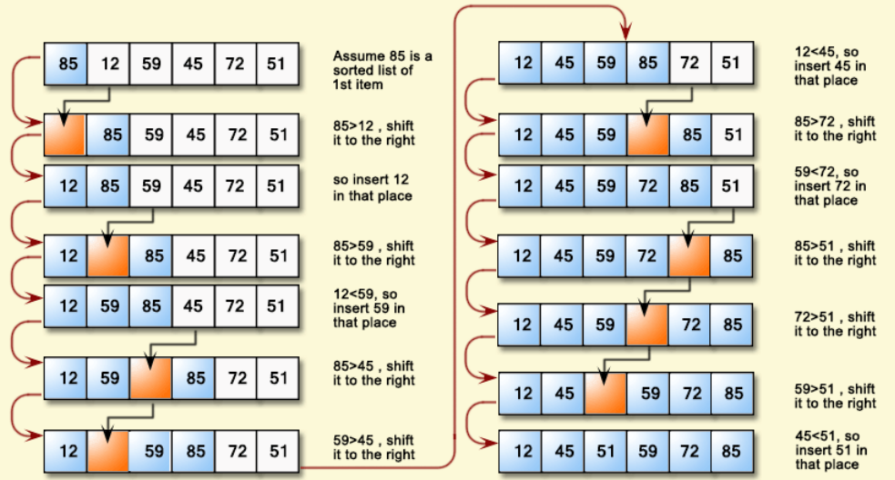
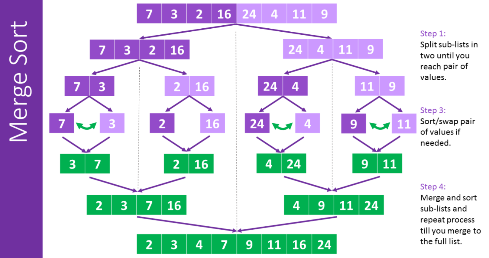
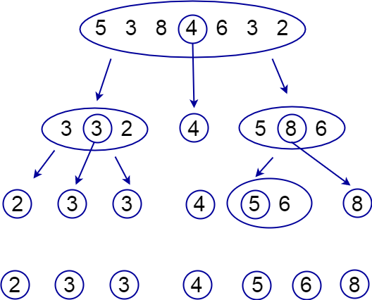
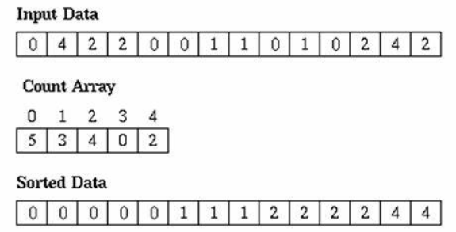

# Sorting

Sorting algorithms are used to transform an unsorted array into a sorted one

## Bubble Sort

Bubble sort is an O(n^2) sorting algorithm that works by repeatedly comparing
adjacent indices within an array and swapping their contents if they are not
in sorted order.

### Steps

- Compare the first and second indices within the array. If they are not in sorted order, swap their contents.
- Repeat this step, but instead of the first and second indices, we use the second and third indices.
- Keep on repeating this process until you reach the end of the array.
- Keep on repeating the three steps above until the entire array is sorted.



### Code

```java
public class Main{
    public static void bubbleSort(int[] arr){
        while(true){
            //count is used to keep track of how many swaps we did
            int count = 0;
            //Loop through the entire array
            for(int i = 1; i < arr.length; i++){
                //Check if the elements at indices i and i - 1 are not sorted
                if(arr[i] < arr[i - 1]){
                    //If they are not sorted, swap them
                    int temp = arr[i-1];
                    arr[i-1] = arr[i];
                    arr[i] = temp;
                    //increment count by 1 because we did a swap
                    count += 1;
                }
            }
            //If count equals zero, meaning we did no swaps, the array is
            //already sorted, so we break out of the while loop
            if(count == 0){
                break;
            }
        }
    }
}
```
Credit: Matthew

## Selection Sort

Selection sort is an O(n^2) algorithm that works by repeatedly finding the minimum element in an array,
and then placing that element near the front of the array, in sorted order

### Steps

- Loop through the array and find the minimum element
- Move this element to the front of the array
- Repeat the above steps, but instead of searching the entire array for the minimum element, we do not search the first element since we already know it is in the correct position
- Keep on repeating the above three steps, each time searching a smaller and smaller portion of the array, until the entire array is sorted



### Code

```java
public class Main{
    public static void selectionSort(int[] arr) {
        //This loops through every index of the array
        for (int i = 0; i < arr.length; i++) {
            //min is used to keep track of the index of the smallest element
            int min = i;
            //Loops through the array starting from the index i, because
            //everything before i has already been sorted
            for (int j = i; j < arr.length; j++) {
                //If the element at index j is smaller than our current minimum,
                //set min to j to update the index of the minimum value
                if (arr[j] < arr[min]) min = j;
            }
            //Swaps the values of the array at indices i and min to move the
            //minimum we found to a sorted position near the front of the array
            int temp = arr[i];
            arr[i] = arr[min];
            arr[min] = temp;
        }
    }
}
```
Credit: Jan

## Insertion Sort

Insertion sort is an O(n^2) algorithm works by maintaining a sorted portion on the left and an unsorted 
portion on the right, and repeatedly moving elements from the beginning of the 
unsorted portion into the correct position within the sorted portion.

### Steps

- Select a key from the beginning of the unsorted portion of the array
- Check if the key is less than the number to its left
- If the key is less, then move the number one index to the right and decrement
the index you are looking at
- Repeat the above two steps until the key is no longer less than the number to
its left
- Set the value of your current index to the key
- Repeat all previous steps until the array is sorted



### Code

```java
public class Main{
    public static void insertionSort(int[] arr) {
        //Loops through the array
        for(int i = 1; i < arr.length; i++){
            //Key is the value at the beginning of the unsorted section
            int key = arr[i];
            //Index keeps track of the index of the value we are comparing the key to
            int index = i - 1;
            //As long as key is less than the value at index, we decrease the index
            while(index >= 0 && key < arr[index] ){
                //Moves the value at index one to the right
                arr[index + 1] = arr[index];
                index--;
            }
            //Set the value at index + 1 to the key because the key is no longer
            //smaller than the value at index
            arr[index + 1] = key;
        }
    }
}
```

Credit: Aaron

## Merge Sort

Merge Sort is an O(n log n) sorting algorithm that sorts an input array by
repeatedly breaking it in half, and then repeatedly merging the halves together

### Steps

- Break the original array into two halves
- Break each half into two more halves, and repeat this process until every 
element is isolated
- Merge two isolated sections together, and merge them so the final result is
in sorted order*
- Repeat the above step repeatedly with the new sections until you have a 
sorted array

*To merge two sorted arrays into one big sorted array, you repeatedly take
the smaller element in the sorted arrays and put it in the big array



### Code

```java
public class Main{
    // Recursive Portion
    public static void mergeSort(int[] input, int left, int right){
        // left < right checks if there are still any elements within this 
        // portion of the array
        if(left < right){
            // This finds the middle of the section we are currently on
            int middle = (left + right)/2;
            // Call mergeSort again, but with the left and right halves of our section
            mergeSort(input, left, middle);
            mergeSort(input, middle + 1, right);
            // Merges the two newly sorted halves of our section together into one sorted section
            merge(input, left, middle, right);
        }
    }
    // This is the merging algorithm
    public static void merge(int[] input, int left, int middle, int right){
        //Create new arrays to store the left and right halves of the section
        int[] leftHalf = new int[middle - left + 1];
        int[] rightHalf = new int[right - middle];

        //Populate those arrays
        for(int i = 0; i < leftHalf.length; i++){
            leftHalf[i] = input[left + i];
        }
        for(int i = 0; i < rightHalf.length; i++){
            rightHalf[i] = input[middle + 1 + i];
        }

        //Create pointers to keep track of where we are in those arrays
        int leftHalfIndex = 0;
        int rightHalfIndex = 0;
        int inputIndex = left;

        //As long as we have not reached the end of the left or right array
        while(leftHalfIndex < leftHalf.length && rightHalfIndex < rightHalf.length){
            //If the first element of the left array is smaller than the
            //first element of the right array, we add the first element
            //of the left array back into the input array
            if(leftHalf[leftHalfIndex] < rightHalf[rightHalfIndex]){
                input[inputIndex] = leftHalf[leftHalfIndex];
                leftHalfIndex++;
                inputIndex++;
            //Otherwise, we add the first element of the right array back
            //into the input array    
            }else if(rightHalf[rightHalfIndex] <= leftHalf[leftHalfIndex]){
                input[inputIndex] = rightHalf[rightHalfIndex];
                rightHalfIndex++;
                inputIndex++;
            }
        }
        // Add all remaining elements in the right array back into our input array
        while(rightHalfIndex < rightHalf.length) {
            input[inputIndex] = rightHalf[rightHalfIndex];
            rightHalfIndex++;
            inputIndex++;
        }
        // Add all remaining elements in the left array back into our input array
        while(leftHalfIndex < leftHalf.length){
            input[inputIndex] = leftHalf[leftHalfIndex];
            leftHalfIndex++;
            inputIndex++;
        }
    }
}
```
## Quicksort

Quicksort is a very efficient sorting algorithm that is used by many programming
languages as the default sorting algorithm. Time Complexity: O(n * log n)

Worst Case: O(n^2) (for backwards arrays)

### Steps

- Find a pivot point (any value within the array)
- Move all elements that are less than the pivot to the left of the pivot
- Move all elements that are more than the pivot to the right of the pivot
- Repeat the previous three steps with the section to the left and right 
of the pivot
- Repeat all previous steps with smaller and smaller sections until the 
entire array is sorted




### Code

```java
public class Main{
    // Recursive Portion
    public static void quickSort(int[] input, int left, int right){
        // left < right checks if there are still any elements within this 
        // portion of the array
        if(left < right){
            // Divider holds the location of the element where everything to
            // the left of that element is less than its value, and everything
            // to the right of that element is greater than its value
            int divider = partition(input, left, right);
            // We recursively call quicksort with the left side of this portion
            // of the array as well as the right side of this portion of the array.
            // Everything to the left side is less than the pivot and everything
            // to the right side is greater than it. The pivot is already in the
            // correct position.
            quickSort(input, left, divider - 1);
            quickSort(input, divider + 1, right);
        }
    }
    // The partition method finds a pivot and moves everything less than it to
    // the left and everything more than it to the right
    public static int partition(int[] input, int left, int right){
        int pivot = input[right];
        int divider = left;
        for(int i = left; i < right; i++){
            if(input[i] < pivot){
                int temp = input[i];
                input[i] = input[divider];
                input[divider] = temp;

                divider++;
            }
        }
        int temp = input[right];
        input[right] = input[divider];
        input[divider] = temp;

        return divider;
    }
}
```

### Benefits of Quicksort
- Very fast
- Very flexible because it uses comparisons


## Counting Sort

Counting sort is an O(n) algorithm that is one of the fastest sorting algorithms.

### Steps

- Create a new array to store how many times every number appears in the input
- Populate this array by looping through the input array
- The index in the new array is the element's value, while the value at
that index is how many times that element appeared
- Loop through the new array to update the values in the original array



### Code

```java
public class Main{
    public static void countingSort(int[] input) {
        // Finds the maximum value int the input array
        int max = input[0];
        for (int i = 1; i < input.length; i++) {
            if (input[i] > max) {
                max = input[i];
            }
        }
        // Creating the new array that stores how many times each element
        // appears in the input array
        int[] counts = new int[max + 1];
        for (int i = 0; i < input.length; i++) {
            counts[input[i]]++;
        }
        
        int inputIndex = 0;
        // Loops through the new array
        for (int i = 0; i < counts.length; i++) {
            // As long as the element at this index in the new array is more
            // than zero, this means there exists some values in the original
            // array that are equal to this index, so we update the original
            // array to add these elements accordingly
            while (counts[i] > 0) {
                input[inputIndex] = i;
                inputIndex++;
                counts[i]--;
            }
        }
    }
}
```