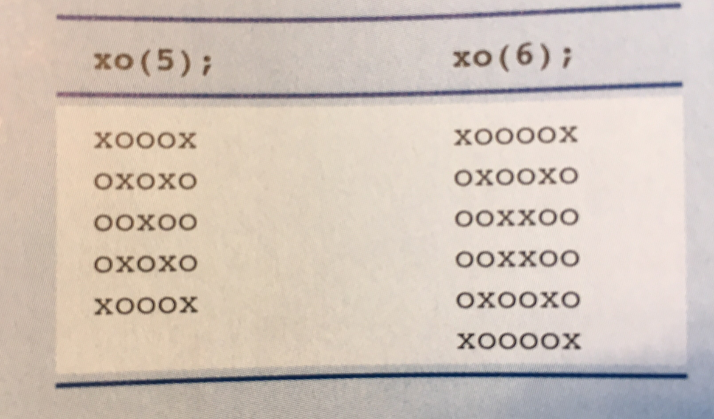

# Markdown Tutorial!

# This is a heading

## This is a smaller heading

### This is an even smaller heading

This is normal text!
This is on the same line as above

**this is bolded text** this unbolded 
*This is italicized* this is not

>This is blockquote text
> 
> It can continue

1. Ordered list
2. For lists!

- Unordered List
- For bullet points

`//for small amounts of code`

The `while()` loop is cool!

```java
public class Main{
    public static void main(String[]args){
        System.out.println("This is how you write java!");
    }
}
```

| Tables          | More tables |
|-----------------|-------------|
| This is a table | Tables!     |

- [ ] This is a task list!
- [ ] Remember the space!
- [x] To mark a task complete, use x

For a horizontal line

---

For links:

[The Guide](https://docs.google.com/document/d/1UiHndmY1Ho1f_Z78rt0P2zo85l7sgqPf5LsCkHyS0VQ/edit?usp=sharing)

Images you can paste directly

