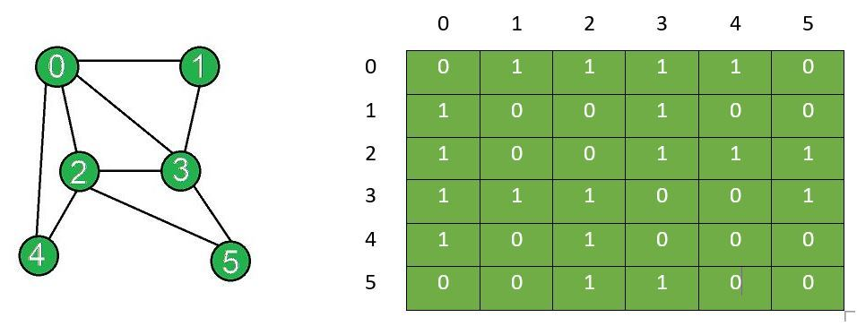
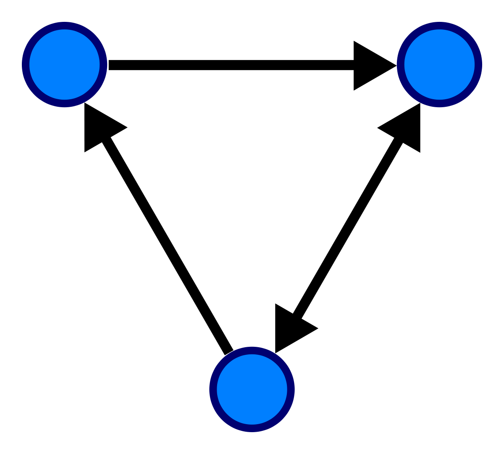
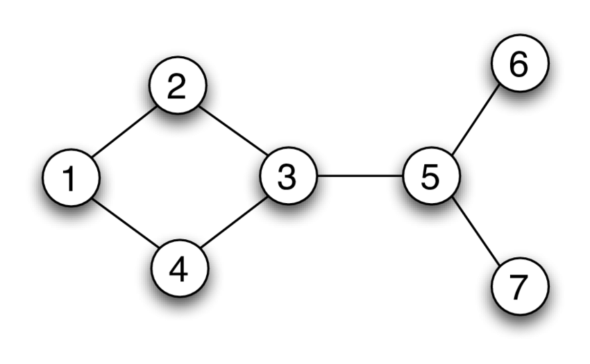

# Graphs

What if you wanted to find the shortest path between two places (eg. two cities)?
This is when you would use a graph. Each city could be a node, and every path
between cities would be an edge

### Definition

A graphs is an abstract data structure that can be used to represent complex,
non-linear relationships between objects. Unlike a tree, a graph has at least
as many edges as nodes.

### Node

Represents elements

### Edges

Represent a connection between elements.

### Representing a graph

Graphs are usually represented using an adjacency matrix. 

### Directed Graph

All edges of a directed graph have a direction indicating what is the
start vertex and what is the end vertex.

### Undirected Graph

All edges of an undirected graph have no direction. It can go in both
ways between the two vertices.

