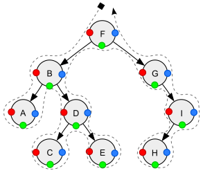

# Traversing a Tree

What if you wanted to visit every element in a tree, and you did that, so
you could find an element, or operate on all the elements. This is where
tree traversal comes into play.

### Depth First Search

Depth first search visits the nodes until it reaches a leaf node, then it
'backtracks' and visits the other node of the parent.

Here is an example of Depth First Search

```java
public class Main {
    public boolean doesElementExist(MyTreeNode root, int element) {
        if (root == null) {
            // we reached the end
            return false;
        }
        if (root.data == element) {
            // The element exists
            return true;
        }
        // visit subtrees
        return doesElementExist(root.left, element)
                || doesElementExist(root.right, element);
    }
}
```

### Tree Traversals



In the image above, red is pre-order, green is in-order, and blue is
post-order traversal

#### Pre-order traversal

Visit the current node, then the left subtree, then the right subtree.

```java
public class Main {
    public static void preOrder(Node node) {
        if (node == null) {
            return;
        }
        System.out.println(node.data);
        preOrder(node.left);
        preOrder(node.right);
    }
}
```

#### In-order traversal

In order traversal visits the left subtree, then the current node,
then the right subtree.

```java
public class Main {
    public static void inOrder(Node node) {
        if (node == null) {
            return;
        }
        inOrder(node.left);
        System.out.println(node.data);
        inOrder(node.right);
    }
}
```

#### Post-order traversal

Visit the left subtree, then the right subtree, then the current node.

```java
public class Main {
    public static void postOrder(Node node) {
        if (node == null) {
            return;
        }
        postOrder(node.left);
        postOrder(node.right);
        System.out.println(node.data);
    }
}
```