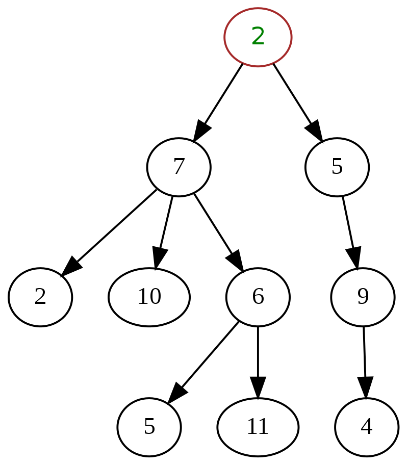
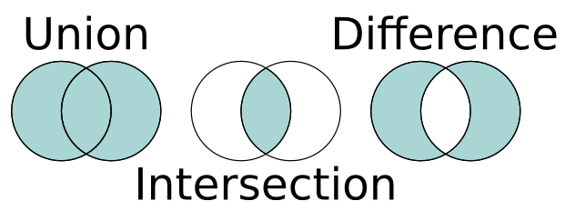

# Sets

What if you don't care about the order of elements
in a collection. You only want to find if an item
exists or not? This is when we use `Set`s

### Definition

A collection that cannot contain duplicates. Order does not matter
in Sets.

### Set Concepts

Java's Collections Framework has a `Set` interface. Two primary
implementations of `Set` include `HashSet` and `TreeSet`.

### `HashSet` Example

This code creates a `Set` of people in this class

```java
import java.util.HashSet;

public class Main {
    public static void main(String[] args) {
        // hashset
        Set<String> names = new HashSet<>();
        // HashSet<String> names = new HashSet<>();
        
        // adding to a set
        names.add("Remy");
        names.add("Victor");
        names.add("Jan");
        names.add("Felix");
        names.add("Joseph");
        names.add("Tom");
        names.add("Matthew");
        names.add("Aaron");
        names.add("Andrew");
        names.add("Eric");
        
        // check if a name is in a set
        boolean remyIsInSet = names.contains("Remy");
        
        // remove from set
        names.remove("Eric"); // Eric is no longer in set
    }
}
```

### `HashSet`s

HashSets are implemented using a special internal array called a
*Hash Table* that places elements into specific positions based upon
integers called *Hash Codes*. 

#### Benefits of `HashSet`

- Constant time lookup
- Constant time insertion
- Constant time removal

#### Drawbacks of `HashSet`

- It takes a lot of storage
- Bad hashes will collide a lot, which will not guarantee constant time.
- A hash function is needed for every object
- It is not ordered

### `TreeSet` example

```java
import java.util.TreeSet;

public class Main {
    public static void main(String[] args) {
        // Creating a TreeSet
        Set<Integer> temperatures = new TreeSet<>();
        // TreeSet<Integer> temperatures = new TreeSet<>();
        
        // adding
        temperatures.add(60);
        temperatures.add(70);
        temperatures.add(80);
        temperatures.add(90);
        
        // check if it contains a value
        boolean isThere90 = temperatures.contains(90);
        
        // remove a value
        temperatures.remove(70);
        
        // print the numbers in sorted order
        for (int item : temperatures) {
            System.out.println(item);
        }
    }
}
```

### `TreeSet`

A `TreeSet` uses an internal linked data structure called a
Binary Search Tree to store its elements in sorted order.

#### Benefits

- Everything is in sorted order
- Takes less space than `HashSet`
- logarithmic time for insertion
- logarithmic time for removal
- logarithmic time for checking if a value is in set
- Time complexity is guaranteed

#### Drawbacks

- Slower than `HashSet`

### Trees and binary search trees

A tree is an abstract data structure that represents
a hierarchical tree structure with a set of connected nodes.



A binary search tree is a tree data structure with the key of
each internal node being greater than all the keys in the respective
node's left subtree and less than the ones in its right subtree.

Red is pre-order, green is in-order, and blue is post-order


### Set operations

| Set Operation    | Method        | Description                                                       |
|------------------|---------------|-------------------------------------------------------------------|
| union            | `addAll`      | Set of all elements that are in A, B, or Both                     |
| intersection     | `retainAll`   | Set of all elements that are in both A and B                      |
| difference       | `removeAll`   | Set of all elements that are in A, but not in B                   |
| superset, subset | `containsAll` | Returns `true` if A is a superset of (contains all elements of) B |
