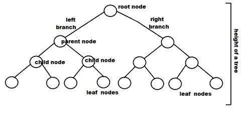

# Binary Trees

What if you have a bunch of solutions, and to find the correct solution,
you answer a bunch of yes/no questions. For example, the first question could
be is it hot? If it is hot, the solution is to use an A/C, and if it is no,
you use a heater.

The solution to our problem is to use a binary tree.

### Definitions

#### Binary Tree

Either an empty tree or a root node (typically storing some data) that refers
to two other trees known as the left subtree and the right subtree.

#### Branch (Branch Node)

A node that has one or more nonempty subtrees.

#### Leaf (Leaf Node)

A node that has two empty subtrees.

#### Parent/Child/Sibling/Ancestor/Descendant

For every node *p* that has a nonempty subtree with root node *q*,
we say that *p* is the parent of *q* and *q* is the child of *p*, which
leads logically to ancestor relationships (parent or parent of ...),
descendant relationships (child of child of ...), and sibling relationships
(two nodes with the same parent).

#### Root of a Tree (Overall Root)

The node at the top of a binary tree, the only node in the tree that has
no parent.

### Benefits

- Binary hierarchical relationships
- Can quickly add and delete nodes (log time to find it)
- Decision trees
- Binary Search Trees

### Drawbacks

- Extra data required to store location of child nodes
- Recursion is required to visit all nodes