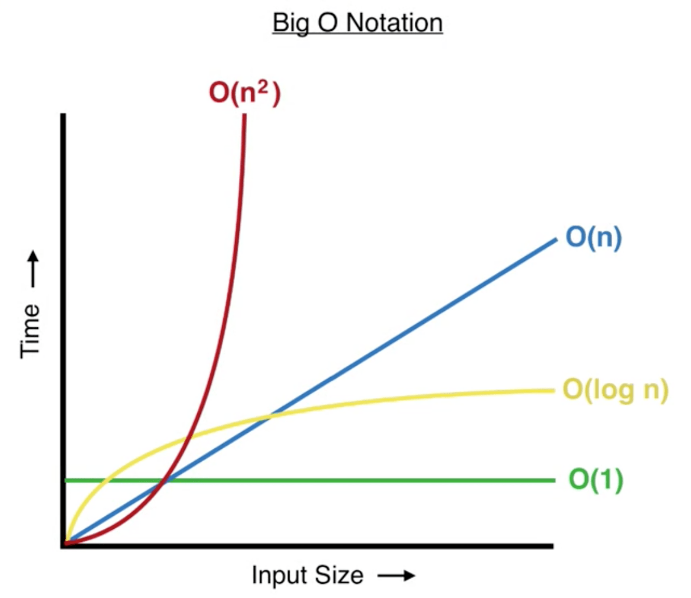

# Complexity

Complexity is a measure of an algorithm's effectiveness, and there is both space and time complexity

## Big O Notation

- A way to describe an algorithm's time or space complexity. Faster algorithms are always better than slower ones.
- Big O Notation is an asymptotic notation - that means that you always take the biggest thing. If an algorithm has time complexity of `n^2 + n`, the Big O Notation would be `O(n^2)`. Also, we get rid of any coefficients, so if an algorithm has time complexity `3n^2`, we simply write `O(n^2)`
- However, taking the biggest thing only applies to addition or subtraction. If you have multiplication or division, for example a runtime of `n * log n`, the Big O Notation would be `O(n log n)`

Constant Time - `O(1)`
- This is if your algorithm runs the same speed regardless of input size

Logarithmic Time - `O(log n)`

- Occurs when you halve the size of your data at every step

Linear Time - `O(n)`

- Occurs when you need to look at every element in an array
- Scales linearly with input size

Polynomial Time - `O(n^2)` or `O(n^3)` or `O(n^a)` where `a` is any positive integer

- Occurs when you have nested for loops

Exponential Time - `O(2^n)` or `O(3^n)` or `O(a^n)` where `a` is any positive integer

- Generating all binary numbers with `n` bits

Factorial Time - `O(n!)`

Bigger Times - `O(n^n)`, etc.

- There is no biggest time, you can always make a bigger time

